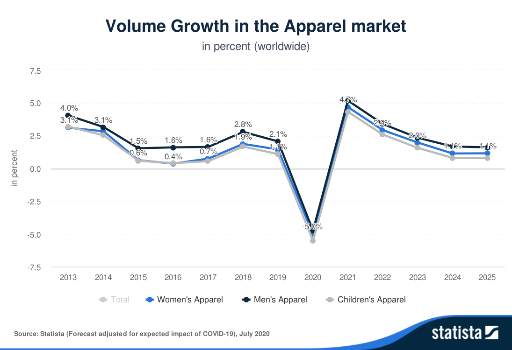

## The link of the Original Picture and Why I select this picture

I selected this picture because I hope to find a macroeconomic data about a business situation influenced by COVID-19. And I hope this macro data is from a reliable source (Statista). You can access this data from the CMU Library resources.

## How I create my own picture

I created my own picture by three steps: 1) wireframe a solution, 2) ask for helps from friends, and 3) draw the picture in Excel.

### Wireframe a solution

After thinking about how to reform it, I made a wireframe for the picture and change three things. First, I changed title of the picture to make the meaning clearer. Second, I distinguished the total growth lines with others to highlight it. Third, I reduced many data labels but only left the extremum.

### Ask for help from friends

I found two friends who are not very familiar with telling stories with data. But their ideas are insightful. I will call them A & B in the answers to each question.

- Can you tell me what you think this is?
A: The trend of Apparel growth
B: The influence of COVID-19

- Can you describe to me what this is telling you?
A: The growth rate of men’s apparel market is higher than the other.
B: The Apparel market is deeply influenced by COVID-19 and it will come back in the further several years.
 	
- Is there anything you find surprising or confusing?
A: I don’t know how to get the number from 2020-2025.
B: I hope you can add colors in the real pictures to make it more readable.

- Who do you think is the intended audience for this?
A: The businessman of Apparel market?
B: The policymaker dealing with COVID-19?

- Is there anything you would change or do differently?
A: I will change the year for 2020-2025 to 2020E - 2025E to make it as an estimation.
B: I will make the unimportant lines grey and only highlight Total.

### Draw the picture in Excel

After receiving the help from friends, I began to draw the picture in Excel. 

Except for accepting the suggestions from my friends (1. change the year for 2020-2025 to 2020E - 2025E to make it as estimation; 2. make the unimportant lines grey and only highlight Total), I used black as the color of the total line to highlight it. I also changed the title to make it more readable. Finally, I reduced most of the data points and only left two. 

### Source: the Statista https://www-statista-com.proxy.library.cmu.edu/outlook/90000000/100/apparel/worldwide
