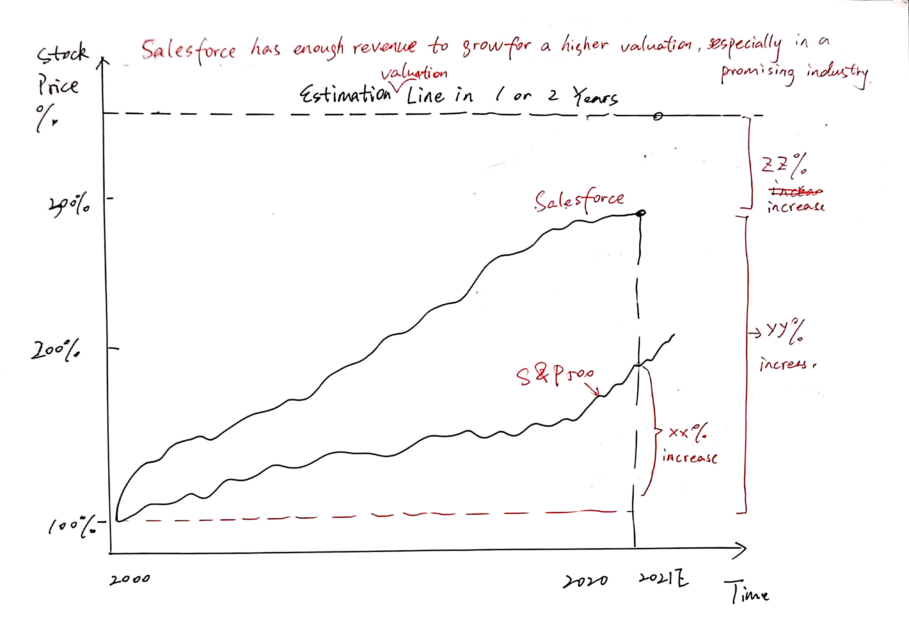
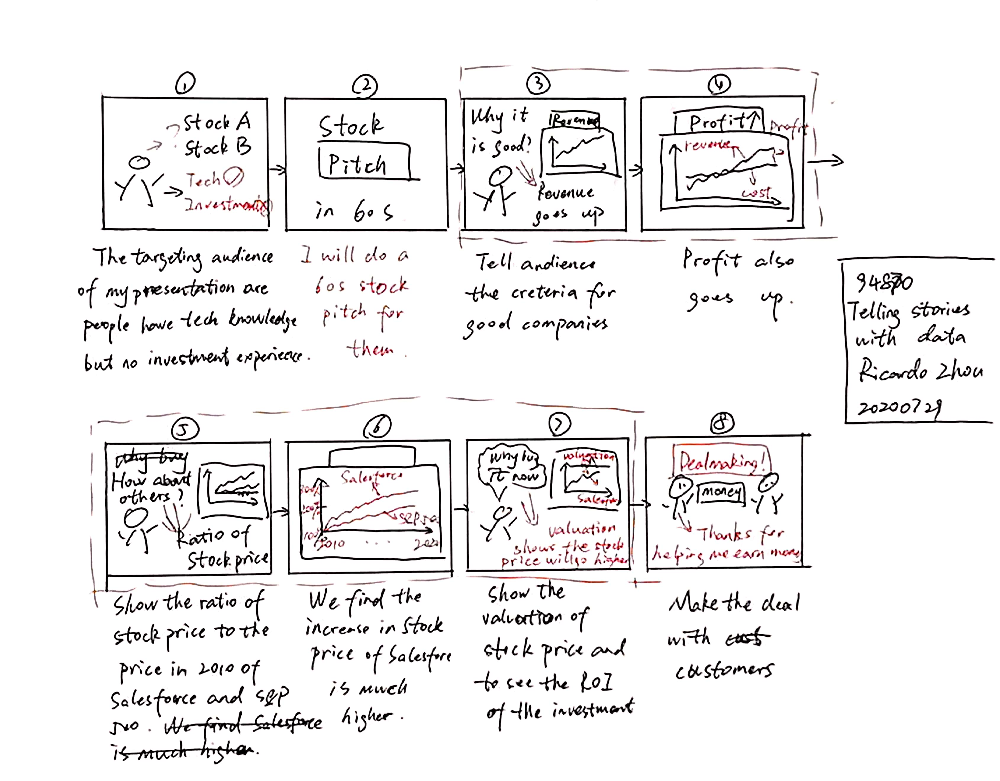
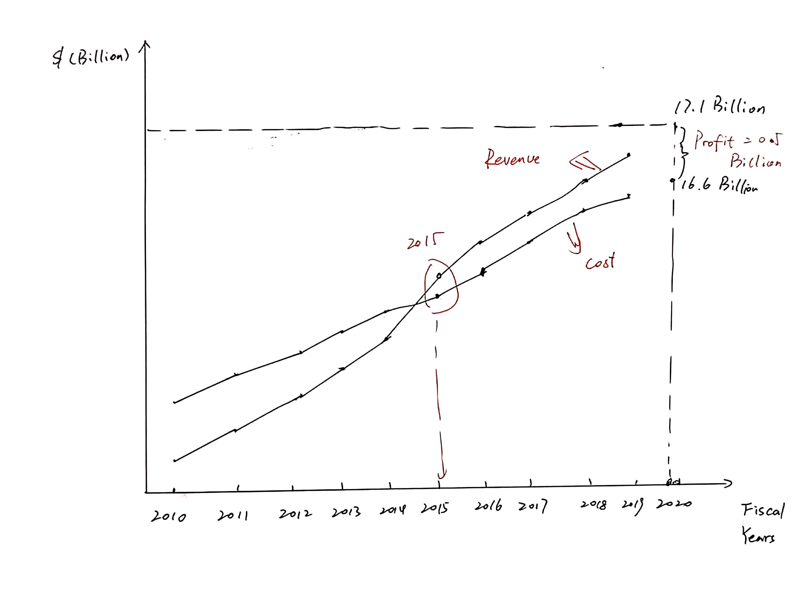

# Final Project Part II

## 1. The idea

### High-Level Introduction
Many people are trying to invest in stock market in March 2020, but they don't know which stock to choose. I give them a list of 5 good companies to invest, and one of them is Salesforce. Salesforce has enough revenue to grow for a higher valuation, especially in a promising industry. 

#### What should my reader do if they understand and agree the story
As a reader, I want to invest in Salesforce's stock so that I can get a high return from my investment.

### Outline

 

My story arc is above. It proves that the audience should buy the stock of Salesforce (call-to-action) for a high return. The X axis shows the time, and the Y axis shows the ratio of stock price compared to 2010. The method is to make comparative analysis, and the medium is the ratio of stock price on my website from a source of Yahoo Finance..

I draw two lines in this picture. The upper one is the line of Salesforce; the lower one is the S&P 500, representing other large companies' stock prices. As we can see here, in the past 10 years, Salesforce's increase in stock price is much higher than the increase of S&P 500. Therefore, compared to the most of the companies in S&P 500, Salesforce is a better target for investment.

Moreover, I draw out a valuation line for Salesforce from some famous financial institutions, such as Yahoo Finance & Capital IQ. With the stock price valuation, we can calculate the future return in 1 or 2 years as I show in the right past.

#### Short description of how it will be completing the final project

I will use Tableau, infogram, and other softwares or website to visualize my data and tell them to my audience. The final outcome will be a website on Shorthand.

Since I only have 1 minute to present, I would like to give you a short introduction and three truths with three figures. First, Valuation. I will show the change of stock price ratio of Salesforce and S&P 500 and compare them. Second, Revenue. I will draw a line of revenue to show the correlation of revenue and stock price, and point out the revenue will go higher. Third, future. I will use the estimation of valuation about Salesforce's stock price to calculate the return of investment (ROI).

And finally, I would make a conclusion for the stock pitch. "Salesforce has enough revenue to grow for a higher valuation, especially in a promising industry."

### Final Dataset
https://github.com/Riczh/Zhou-portfolio/blob/master/Ricardo%20ZHOU_TSWD%20data.xlsx

The datasets from three sources:
1. The Annual reports of Salesforce https://investor.salesforce.com/financials/default.aspx
2. The data of Yahoo Finance https://finance.yahoo.com/quote/CRM?p=CRM&.tsrc=fin-srch
3. The data of Capital IQ https://www.capitaliq.com/CIQDotNet/my/dashboard.aspx (Need to log in CMU VPN)
4. Apps Run the World https://www.appsruntheworld.com/top-10-cloud-crm-software-vendors-market-size-and-forecast-2019-2024/

### The sources of data and how will I use them
The datasets mainly from three sources, the annual report of Salesforece, Yahoo Finance and Capital IQ. 

In this process, I used these data as follows. First of all, I showed the changes in revenue and cost of Salesforce in the past 10 years. It can be found that revenue is increasing rapidly, and the growth rate is faster than cost, which means that the profit is also increasing rapidly. Secondly, in the second graph, I will use 2010 stock prices as a baseline to see the percentage growth of Salesforce and S&P 500. It can be clearly seen that Salesforce's stock price is growing faster than S&P 500. Finally, it shows the future stock price estimate, explaining what the return of buying Salesforce now will be in one year.

## 2. Design and user research

### Wireframe & StoryBoard

My storyboards should be a visual walkthrough of the primary elements of your outline. It can be divided into three parts. Figures 1, 2, and 8 are the introduction to the background content and results, Figures 3 and 4 are the introduction to the revenue part, and 5, 6, and 7 are the introduction to most of the contents. These three parts are a good demonstration of the type of audience and the whole process of persuading the audience to buy stocks and invest.

### Data visualizations

I will draw a line of revenue to show the correlation of revenue and stock price, and point out the revenue will go higher. I showed the changes in revenue and cost of Salesforce in the past 10 years. It can be found that revenue is increasing rapidly, and the growth rate is faster than cost, which means that the profit is also increasing rapidly.

I will show the change of stock price ratio of Salesforce and S&P 500 and compare them. I will use the estimation of valuation about Salesforce's stock price to calculate the return of investment (ROI).

### User research protocol

The user research protocol identifies the following: 

#### a. the target audience you hope to reach with your story:
My target audience of my presentation are rich people have technology knowledge but no investment experience. However, they still want to earn extra money by buying stocks. Therefore, my plan is to introduce a company that they may hear before, and use financial data to tell a story about the stock that the stock price will go higher in a year.

#### b. your approach to identifying representative individuals to interview: 
As a CMU student, I have network of tech people. If they enter FAMMA, it is possible that they are rich enough to make some plan in investment. So, I can find some of my CMU friends who are in these companies.

#### c. your interview script:
- Can you tell me what you think this is?
- Can you describe to me what this is telling you?
- Is there anything you find surprising or confusing?
- Is there anything you would change or do differently?

### User Interviews

Interviewee 1: 
-Can you tell me what you think this is?
Some simulations of the situations.

-Can you describe to me what this is telling you?
I feel that you are using pictures to show some situations in your imagination, and finally show the idealized success.

-Is there anything you find surprising or confusing?
I don't really understand the meaning of drawing this thing, because it's just based on your imagination. In reality, it's impossible to succeed so easily.

-Is there anything you would change or do differently?
I think this thing is meaningless, you should show me your code and create the thing first.

Interviewee 2: 
- Can you tell me what you think this is?
Interviewee: To be honest, I didn't understand, because these pictures of yours have no titles. I don't know what the core content you want to say is, and what kind of connection they have.

Ricardo: Actually this is a storyboard, which explains the whole process of a presentation I am going to do.

Interviewee: Well, who is your target audience?

Ricardo: People like you.

-Can you describe to me what this is telling you?
It seems that you are trying to make a stock pitch and finally reached a deal, but I am not sure why you should buy it.

-Is there anything you find surprising or confusing?
Maybe it's because of the length. I don't think the logic inside is very clear. For example, if you just buy stocks like this, won't you worry about falling?

-Is there anything you would change or do differently?
I didn't think about it, I should add a title, and write the background information you introduced to me before.

Interviewee 3: 
-Can you tell me what you think this is?
A storyboard? I drew something similar before in our company.

-Can you describe to me what this is telling you?
It should be a certain kind of process. You want to make a stock pitch, right? I think you have written your target customer group here, which is quite similar to me.

-Is there anything you find surprising or confusing?
To be honest, the pictures are too small, and some pictures are not clear (show data visualizations). These two can be seen clearly, but the drawing is rather sloppy. I hope you can add more details to the real content. For example, you can show the CAGR of Revenue and Cost to compare the growth rates of the two.

-Is there anything you would change or do differently?
I will add CAGR, and then mark more data points in each graph. But I think it still lacks a little persuasiveness in the end. That's why you want to buy stocks and not do other things. You can think about it.

### Revised design: Changes that plan on implementing to the visualizations next week to address the issues identified

1) Add a Title for each picture to explain the context and my idea

2) Add more details in the real data visualizations.

3) Compare the ROI of investing in Salesforce with other methods.

### Wireframes based off of user research and a summary of findings. 
待完成

Part II writeup includes a few paragraphs that talk about the intended audience for your final data story. Personas and / or other information used to narrow the focus are included. Specific things that were changed between Part I and II are noted based on user feedback.

## 3. Final data story

A few paragraphs that talk about the intended audience for your final data story.  Include any personas and / or other information you've used that helped you narrow the focus.  Talk about specific things you did to your final project to make it work for your audience. 
A few paragraphs that summarize the work you've done so far.  Talk about the design decisions you had to make along the way, and reflect on anything in particular that stands out to you that you learned working through the process. 
Include a link to your updated Github repository that includes a link to your final data story (e.g. a link to your Shorthand / StoryMap or other final project).  Make sure your data story is published and publicly accessible. 
Add a link to your final data story (a direct link to Shorthand / StoryMap / etc.) placed in the final presentation spreadsheet on Canvas.  Add the link next to your name in the spreadsheet, and update the title to reflect the working title for your presentation.
Include all references for materials used.  It's your responsibility to ensure you have permission to use imagery and other assets, and that you use them appropriately.  A reminder to NOT USE COPYRIGHTED MATERIAL - see the library's guide to ensure you are using images correctlyLinks to an external site..  Make sure to add / update any citations and / or other content that you used to create your data story.  References should also be clearly identified on your final data story itself.  
Include any other information that helps round out your data story. 

## Links and references
Images are cited correctly, follow library guidelines on acceptable use. Links working. Final page includes all links / references for everything used in project. Citations are detailed enough to easily track back to original sources.

## Github and Shorthand links
Link to the main Github repository (portfolio page) and the final publicly available Shorthand (or other acceptable site) is included. Other information as relevant / needed included in the Part II writeup.
