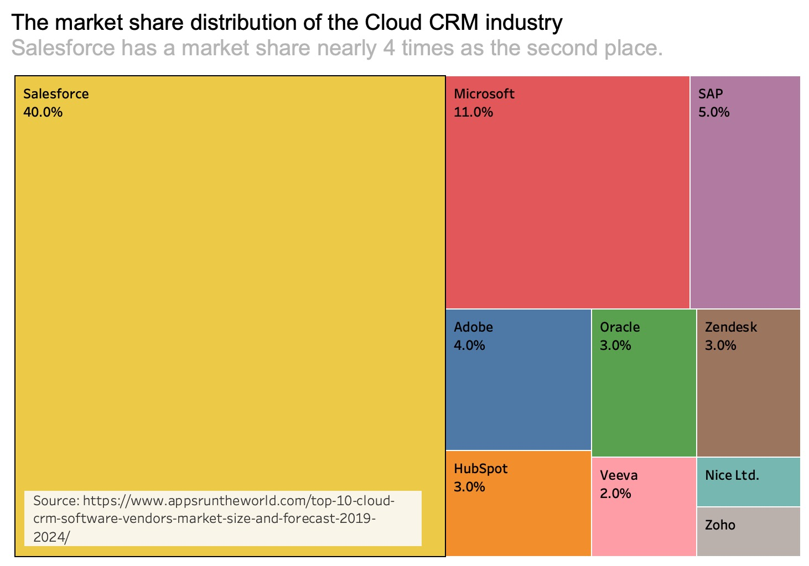

# Final Project Part II

## 1. The idea

### High-Level Introduction
Many people are trying to invest in the stock market in April 2020, but they don't know which stock to choose. I give them a list of 5 good companies to invest in, and one of them is Salesforce. Salesforce has enough revenue to grow for a higher valuation, especially in a promising industry. 

#### What should my reader do if they understand and agree with the story
As a reader, I want to invest in Salesforce's stock to get a high return from my investment.

### Outline

 

My story arc is above. It proves that the audience should buy the stock of Salesforce (call-to-action) for a high return. The X-axis shows the time, and the Y-axis shows the ratio of stock price compared to 2010. The method is to make a comparative analysis, and the medium is the ratio of the stock price on my website from a source of Yahoo Finance.

I draw two lines in this picture. The upper one is the line of Salesforce; the lower one is the S&P 500, representing other large companies' stock prices. As we can see here, in the past ten years, Salesforce's increase in stock price is much higher than the rise in the S&P 500. Therefore, compared to most of the S&P 500, Salesforce is a better target for investment.

Moreover, I draw a valuation line for Salesforce from some famous financial institutions, such as Yahoo Finance & Capital IQ. With the stock price valuation, we can calculate future returns in 1 or 2 years as I show in the right past.

#### Short description of how it will be completing the final project

I will use Tableau, infogram, and other software or website to visualize my data and tell them to my audience. The outcome will be a website on Shorthand.

Since I only have 1 minute to present, I would like to give you a short introduction and three truths with three figures. First, Valuation. I will show the change in the stock price ratio of Salesforce and the S&P 500 and compare them. Second, Revenue. I will point out the revenue is so high. Third, future. I will use the estimation of valuation about Salesforce's stock price to calculate the return of investment (ROI).

And finally, I would conclude the stock pitch. "Salesforce has enough revenue to grow for a higher valuation, especially in a promising industry."

### Final Dataset
https://github.com/Riczh/Zhou-portfolio/blob/master/Ricardo%20ZHOU_TSWD%20data.xlsx

The datasets from four sources:
1. The Annual reports of Salesforce https://investor.salesforce.com/financials/default.aspx
2. The data of Yahoo Finance https://finance.yahoo.com/quote/CRM?p=CRM&.tsrc=fin-srch
3. The data of Capital IQ https://www.capitaliq.com/CIQDotNet/my/dashboard.aspx (Need to log in CMU VPN)
4. Apps Run the World https://www.appsruntheworld.com/top-10-cloud-crm-software-vendors-market-size-and-forecast-2019-2024/

### The sources of data and how will I use them
The datasets mainly from three sources, the annual report of Salesforce, Yahoo Finance, and Capital IQ. 

In this process, I used these data as follows. I showed the changes in revenue and cost of Salesforce in the past ten years. It can be found that income is increasing rapidly, and the growth rate is faster than cost, which means that the profit is also growing rapidly. Secondly, in the second graph, I will use 2010 stock prices as a baseline to see the percentage growth of Salesforce and S&P 500. It can be seen that Salesforce's stock price is growing faster than the S&P 500. Finally, it shows the future stock price estimate, explaining what the return of buying Salesforce now will be in one year.

## 2. Design and user research

### Wireframe & StoryBoard

My storyboards should be a visual walkthrough of the primary elements of your outline. It can be divided into three parts. Figures 1, 2, and 8 are the introduction to the background content and results, Figures 3 and 4 are the introduction to the revenue part, and 5, 6, and 7 are the introduction to most of the contents. These three parts are a good demonstration of the type of audience and the whole process of persuading the audience to buy stocks and invest.

### Previous Data visualizations

I will draw a line of revenue to show the correlation between revenue and stock price, and point out the income will go higher. I showed the changes in tax and the cost of Salesforce in the past ten years. It can be found that revenue is increasing rapidly, and the growth rate is faster than the price, which means that the profit is also growing rapidly.

I will show the change in the stock price ratio of Salesforce and the S&P 500 and compare them. I will use the estimation of valuation about Salesforce's stock price to calculate the return of investment (ROI).

### User research protocol

The user research protocol identifies the following: 

#### a. the target audience you hope to reach with your story:
The target audience of my presentation is rich people who have technology knowledge but no investment experience. However, they still want to earn extra money by buying stocks. Therefore, I plan to introduce a company that they may hear before and use financial data to tell a story about the capital that the stock price will go higher in a year.

#### b. your approach to identifying representative individuals to interview: 
As a CMU student, I have a network of tech people. If they enter FAMMA, it is possible that they are rich enough to make some plans in investment. So, I can find some of my CMU friends who are in these companies.

#### c. your interview script:
- Can you tell me what you think this is?
- Can you describe to me what this is telling you?
- Is there anything you find surprising or confusing?
- Is there anything you would change or do differently?

### User Interviews

Interviewee 1: 
-Can you tell me what you think this is?
Some simulations of the situations.

-Can you describe to me what this is telling you?
I feel that you are using pictures to show some situations in your imagination, and finally show the idealized success.

-Is there anything you find surprising or confusing?
I don't really understand drawing this thing, because it's just based on your imagination. In reality, it's impossible to succeed so quickly.

-Is there anything you would change or do differently?
I think this thing is meaningless; you should show me your code and create the thing first.

Interviewee 2: 
- Can you tell me what you think this is?
Interviewee: To be honest, I didn't understand, because these pictures of yours have no titles. I don't know what the core content you want to say is, and what kind of connection they have.

Ricardo: Actually this is a storyboard, which explains the whole process of a presentation I am going to do.

Interviewee: Well, who is your target audience?

Ricardo: People like you.

-Can you describe to me what this is telling you?
It seems that you are trying to make a stock pitch and finally reached a deal, but I am not sure why you should buy it.

-Is there anything you find surprising or confusing?
Maybe it's because of the length. I don't think the logic inside is very clear. For example, if you just buy stocks like this, won't you worry about falling?

-Is there anything you would change or do differently?
I didn't think about it; I should add a title, and write the background information you introduced to me before.

Interviewee 3: 
-Can you tell me what you think this is?
A storyboard? I drew something similar before in our company.

-Can you describe to me what this is telling you?
It should be a certain kind of process. You want to make a stock pitch, right? I think you have written your target customer group here, which is quite similar to me.

-Is there anything you find surprising or confusing?
To be honest, the pictures are too small, and some are not clear (show data visualizations). These two can be seen clearly, but the drawing is rather sloppy. I hope you can add more details to the real content. For example, you can show the CAGR of Revenue and Cost to compare the growth rates of the two.

-Is there anything you would change or do differently?
I will add CAGR, and then mark more data points in each graph. But I think it still lacks a little persuasiveness in the end. That's why you want to buy stocks and not do other things. You can think about it.

### Revised design: Changes that plan on implementing to the visualizations next week to address the issues identified

1) Add a Title for each picture to explain the context and my idea

2) Add more details in the real data visualizations.

3) Compare the ROI of investing in Salesforce with other methods.

### Wireframes based off of user research and a summary of findings. 

Salesforce has a very high market share and dominance in Cloud CRM, close to 4 times as the second place.

#### I cannot embed this picture on Tableau online since I cannot sign in. When I try to sign in, Tableau Server told me this site had been suspended. You must be a System Administrator to sign in (errorCode = 10029). When I try to create a new account to sign in, it told me unable to sign in for an invalid username or password. So I can only use a screenshot to do this.

Salesforce's current revenue is very high so that the company has enough stability not to fail in a crisis. I will draw a line of revenue to show the correlation between revenue and stock price, and point out the revenue will go higher. I showed the changes in revenue and cost of Salesforce in the past ten years. It can be found that revenue is increasing rapidly, and the growth rate is faster than cost, which means that the profit is also increasing rapidly.

This is the change in the stock price of Salesforce and other large companies' indexes from 2015 to the present. Salesforce's growth rate is much higher than other companies in the market, and it is expected to continue to grow rapidly in the next several months. I will show the change in stock price ratio of Salesforce and S&P 500 and compare them. I will use the estimation of valuation about Salesforce's stock price to calculate the return of investment (ROI).

###
待完成
Part II writeup includes a few paragraphs that talk about the intended audience for your final data story. Personas and / or other information used to narrow the focus are included. Specific things that were changed between Part I and II are noted based on user feedback.

## 3. Final data story

### Talk about my intended audience for the final story
Suppose we have a Time Machine and come back to April 2020. You are an employee of one of the best tech companies and just graduated from CMU, who is interested in investing in stocks but have no experience.  And as a stockbroker, I am going to introduce the Salesforce to persuade you to buy the stock. 

### How would I tell the 1-minute story to my audience
Hey, if you want to make money by investment but never try it, here is the way. There are the best five stocks that might suit you. And I will introduce Salesforce among them, with three pictures.

First, Salesforce has a very high market share and dominance in Cloud CRM, close to 4 times as the second place.

Secondly, Salesforce's current revenue is very high, so that the company has enough stability not to fail in a crisis.

Finally, this is the change in the stock price of Salesforce and other large companies' indexes from 2010 to the present. Salesforce's growth rate is much higher than other companies in the market, and it is expected to continue to grow rapidly in the next 1-2 years. 
Therefore, using the following two websites, buy the stock, But buy the amount that makes you comfortable. We are not here to make you nervous; we are here to help you make money.

I also prepared in-depth industry research and financial analysis. If you are interested, you can read it on our website.

If someone wants to sell a stock like this, don't trust them. They are just a bloody stockbroker who wants to get your money to their pocket. I am Serious!

### A few paragraphs that summarize the work you've done so far

For the whole Shorthand website, I have six parts on the website. The first one is the background. I would like to give my audience a hypothetical situation and involve them. Then, I put three pictures in an investment thesis, which is the key part of my one-minute presentation. I also have an industry overview and financial analysis to give more detail to potential investors about the company. Finally, I have a call-to-action to make people move for that. I also list references and sources of information or tools for my presentation.

## 4. Links and references

### The datasets from four sources:
1. The Annual reports of Salesforce https://investor.salesforce.com/financials/default.aspx
2. The data of Yahoo Finance https://finance.yahoo.com/quote/CRM?p=CRM&.tsrc=fin-srch
3. The data of Capital IQ https://www.capitaliq.com/CIQDotNet/my/dashboard.aspx (Need to log in CMU VPN)
4. Apps Run the World https://www.appsruntheworld.com/top-10-cloud-crm-software-vendors-market-size-and-forecast-2019-2024/

### Stock Photos:
1. Photo by Essow Kedelina from Pexels https://www.pexels.com/photo/gray-high-rise-buildings-936722/
2. Photo by energepic.com from Pexels https://www.pexels.com/photo/blue-and-yellow-graph-on-stock-market-monitor-159888/
3. Photo by Lukas from Pexels https://www.pexels.com/photo/close-up-photo-of-man-wearing-black-suit-jacket-doing-thumbs-up-gesture-684385/
4. Photo by picjumbo.com from Pexels https://www.pexels.com/photo/ballpen-blur-close-up-computer-461077/
5. Photo by Markus Spiske from Pexels https://www.pexels.com/photo/black-and-white-newspaper-stock-exchange-stock-market-102152/
6. Photo by Trang Doan from Pexels https://www.pexels.com/photo/people-in-couch-1024248/

### Data Visualization Tools

1. Tableau https://www.tableau.com/
2. Flourish Studio https://flourish.studio/
3. Infogram https://infogram.com/

### Github and Shorthand links
- Shorthand https://carnegiemellon.shorthandstories.com/stock-pitch-for-salesforce/index.html
- Github https://github.com/Riczh/Zhou-portfolio
